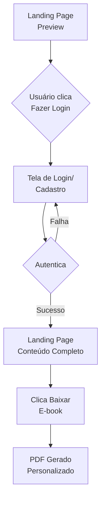

# 🚀 Trilhas da Transformação Tech | E-book DIO

<div align="center">
  
  
  
  
  
  **Uma landing page premium com sistema de autenticação e geração de PDF personalizado**
  
  [🌐 Ver Projeto](https://marciogil.github.io/E-book-Bootcamp/) • [📥 Baixar E-book](#-como-usar) • [📖 Documentação](#-características)
  
</div>

---

## 📋 Sobre o Projeto

**Trilhas da Transformação Tech** é uma landing page moderna e interativa que apresenta 6 trilhas de aprendizado na área de tecnologia, totalizando 12 bootcamps gratuitos da plataforma DIO (Digital Innovation One).

O projeto possui um sistema de autenticação client-side e permite que usuários registrados baixem um e-book personalizado em PDF contendo todas as informações dos bootcamps com links de afiliado protegidos.

### 🎯 Objetivo

Facilitar o acesso a bootcamps gratuitos de qualidade enquanto protege links de afiliado através de um sistema de cadastro, transformando visitantes em leads qualificados.

---

## ✨ Características

### 🔐 Sistema de Autenticação
- ✅ Registro de novos usuários
- ✅ Login com validação de credenciais
- ✅ Armazenamento seguro com localStorage
- ✅ Proteção de conteúdo premium

### 🎨 Design Premium
- ✅ Interface moderna com gradientes animados
- ✅ Animações suaves e interativas
- ✅ Efeitos hover sofisticados
- ✅ Responsivo para todos os dispositivos
- ✅ Modo de acessibilidade integrado

### 📄 Geração de PDF Personalizado
- ✅ PDF personalizado com nome do usuário
- ✅ Foto do autor na capa
- ✅ 3 páginas motivacionais sobre educação
- ✅ Informações completas de 12 bootcamps
- ✅ Links de afiliado incluídos
- ✅ Design profissional e organizado

### 🛡️ Proteção de Links
- ✅ Landing page como preview atrativo
- ✅ Bootcamps completos visíveis apenas após login
- ✅ Links de afiliado protegidos por autenticação
- ✅ Transição suave entre conteúdo público e privado

---

## 🎭 Trilhas Disponíveis

| Trilha | Descrição | Bootcamps |
|--------|-----------|-----------|
| 💻 **Front-End** | Crie interfaces modernas | 2 bootcamps |
| ⚙️ **Back-End** | Desenvolva sistemas robustos | 2 bootcamps |
| ☁️ **Cloud Computing** | Construa na nuvem | 2 bootcamps |
| 🧠 **IA e Dados** | Transforme dados em insights | 2 bootcamps |
| 🧩 **Carreiras Tech** | Inicie do zero | 2 bootcamps |
| 🎮 **Game Development** | Crie jogos incríveis | 2 bootcamps |

**Total: 12 bootcamps gratuitos!**

---

## 🛠️ Tecnologias Utilizadas

### Frontend


### Bibliotecas
- **html2pdf.js** v0.10.1 - Geração de PDF client-side
- **localStorage API** - Persistência de dados

### Arquitetura CSS
```
styles.css          → Estilos base do projeto
accessibility.css   → Melhorias de acessibilidade
premium-styles.css  → Estilos premium com gradientes
animations.css      → Animações e efeitos visuais
```

---

## 📁 Estrutura do Projeto

```
E-book-Bootcamp/
│
├── 📄 index.html              # Landing page principal
├── 📄 login.html              # Página de autenticação
│
├── 🎨 styles.css              # Estilos base
├── 🎨 accessibility.css       # Estilos de acessibilidade
├── 🎨 premium-styles.css      # Estilos premium
├── ✨ animations.css          # Animações avançadas
│
├── 🔐 auth.js                 # Sistema de autenticação
├── 📥 pdf-generator.js        # Geração de PDF
│
├── 📂 assets/
│   └── 📸 foto-marcio-gil.jpg
│
└── 📖 README.md
```

---

## 🚀 Como Usar

### 1️⃣ Clone o repositório
```bash
git clone https://github.com/MarcioGil/E-book-Bootcamp.git
cd E-book-Bootcamp
```

### 2️⃣ Abra o projeto
```bash
# Com Python
python -m http.server 8000

# Com Node.js
npx http-server

# Ou abra index.html diretamente no navegador
```

### 3️⃣ Acesse no navegador
```
http://localhost:8000
```

### 4️⃣ Faça o cadastro
1. Clique em "Fazer Login para Ver"
2. Vá para a aba "Cadastrar"
3. Preencha seus dados
4. Faça login

### 5️⃣ Baixe o e-book
Clique em "Baixar E-book em PDF" para gerar seu PDF personalizado! 📥

---

## 🎯 Fluxo do Usuário



---

## 🔐 Sistema de Autenticação

### Registro
```javascript
register(name, email, password)
  → Valida dados
  → Hash da senha
  → Salva no localStorage
  → Retorna sucesso/erro
```

### Login
```javascript
login(email, password)
  → Verifica credenciais
  → Define usuário atual
  → Redireciona para index
```

### Proteção
```javascript
if (isLoggedIn()) {
  showProtectedContent()
} else {
  redirect('login.html')
}
```

---

## 📥 Estrutura do PDF

1. 📘 **Capa**: Foto do autor + Título
2. 💭 **Páginas Motivacionais** (3):
   - O Poder Transformador da Educação
   - Uma Oportunidade Única na História
   - Sua História de Sucesso Começa Aqui
3. 📖 **Introdução**: Apresentação do guia
4. 🎯 **Trilhas** (6): Cada trilha com bootcamps
5. ✅ **Conclusão**: Próximos passos
6. 👤 **Sobre o Autor**: Contato e redes

---

## 🎨 Paleta de Cores

<table>
<tr>
<td align="center">

<br/><b>#8b5cf6</b><br/>Purple
</td>
<td align="center">

<br/><b>#06b6d4</b><br/>Cyan
</td>
<td align="center">

<br/><b>#0f172a</b><br/>Dark BG
</td>
<td align="center">

<br/><b>#1e293b</b><br/>Card BG
</td>
</tr>
</table>

---

## 🏆 Diferenciais

| Característica | Descrição |
|----------------|-----------|
| ✨ Design Profissional | Visual moderno e atrativo |
| 🔒 Links Protegidos | Sistema de autenticação eficiente |
| 📄 PDF Personalizado | E-book único para cada usuário |
| 🎯 SEO Friendly | Meta tags otimizadas |
| ♿ Acessível | WCAG 2.1 Level AA |
| 📱 Responsivo | Todos os dispositivos |
| ⚡ Performance | Carregamento otimizado |
| 🎨 Animações | Experiência interativa |

---

## 📊 Métricas do Projeto

- **12** Bootcamps gratuitos
- **6** Trilhas de aprendizado
- **771** linhas de CSS premium
- **15+** Efeitos hover interativos
- **100%** responsivo
- **0** dependências de backend

---

## 🎬 Preview das Animações

- ✨ **Fade In Up**: Cards aparecem gradualmente
- 🌊 **Wave Animation**: Ondas no hero
- ⭐ **Twinkle Stars**: Estrelas no fundo
- 🎆 **Gradient Rotation**: Bordas animadas
- ✨ **Shine Effect**: Brilho nos badges
- 🎯 **Hover Transforms**: Interações suaves

---

## 🤝 Contribuindo

Contribuições são bem-vindas!

1. Fork o projeto
2. Crie uma branch (`git checkout -b feature/Nova`)
3. Commit (`git commit -m 'Add: Nova feature'`)
4. Push (`git push origin feature/Nova`)
5. Pull Request

---

## 📝 Licença

Este projeto está sob a licença MIT.

---

## 👨‍💻 Autor

<div align="center">
  
  ### **Márcio Gil**
  **Embaixador DIO Campus Expert**
  
  [](https://linkedin.com/in/márcio-gil-1b7669309)
  [](https://github.com/MarcioGil)
  [](https://marciogil.github.io/curriculum-vitae/)
  
  💼 Conecte-se comigo para networking e oportunidades!
  
</div>

---

## 🙏 Agradecimentos

- **DIO** - Plataforma incrível de bootcamps
- **Comunidade Tech** - Apoio constante
- **Você** - Por usar este projeto! 🚀

---

## 📈 Roadmap

### Próximas Versões

#### v2.1
- [ ] Backend com Node.js + MongoDB
- [ ] Sistema de email
- [ ] Dashboard do usuário

#### v2.2
- [ ] PWA (Progressive Web App)
- [ ] Modo escuro/claro
- [ ] Analytics integrado

#### v3.0
- [ ] Sistema de notificações
- [ ] Blog integrado
- [ ] Gamificação com badges

---

<div align="center">
  
  ### ⭐ Se este projeto foi útil, dê uma estrela!
  
  **Feito com 💜 por [Márcio Gil](https://github.com/MarcioGil)**
  
  ```
  ╔═══════════════════════════════════════╗
  ║  🚀 Transforme sua carreira tech!    ║
  ║  📚 Aprenda com os melhores!         ║
  ║  💪 Comece agora, é 100% gratuito!   ║
  ╚═══════════════════════════════════════╝
  ```
  
  
  
  
</div>
